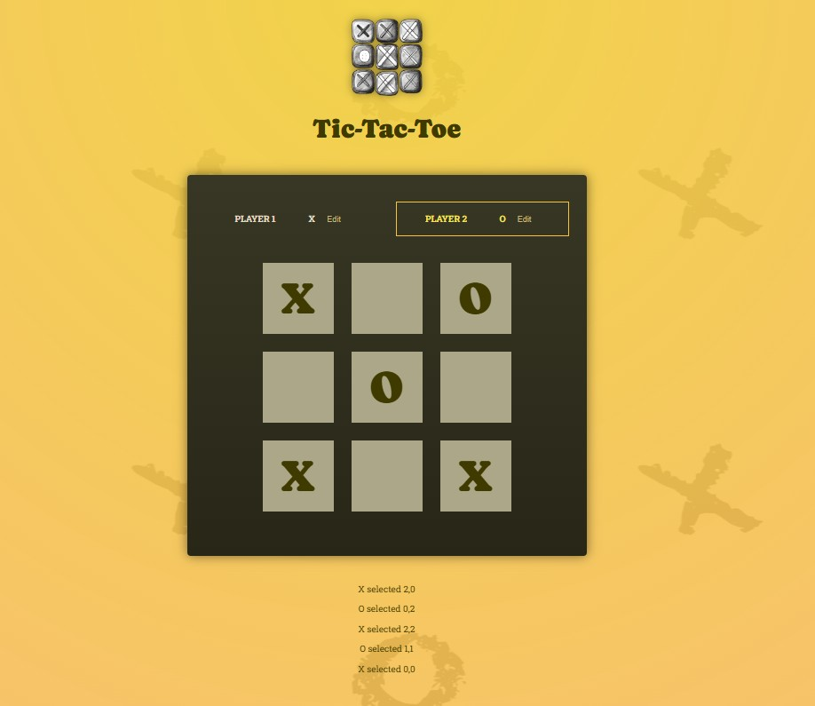
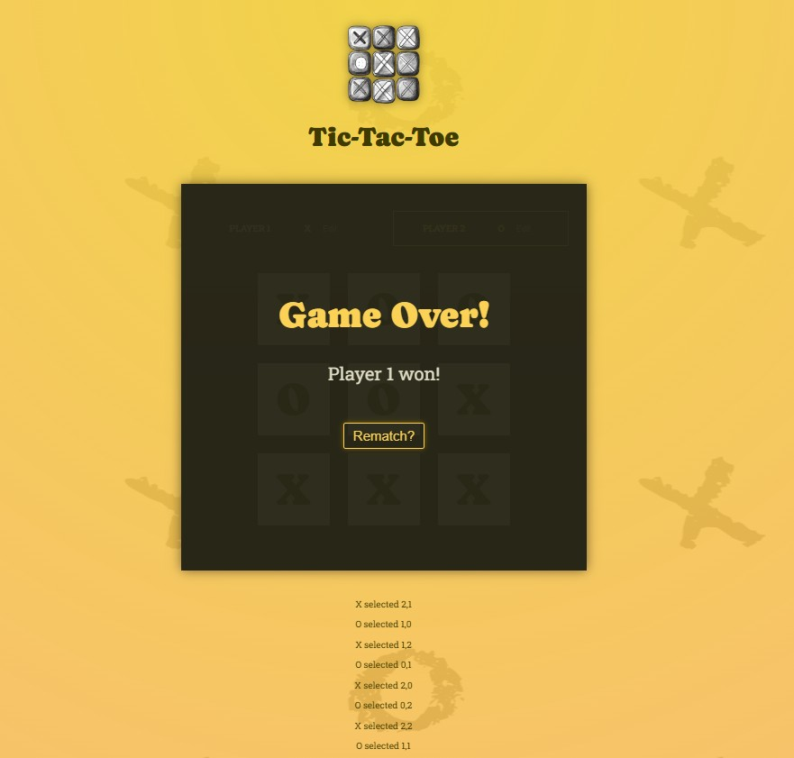

# Tic Tac Toe

A simple Tic Tac Toe game built with React.

## About

This project was created while following Maximilian Schwarzmüller's React course. It focuses on practicing React fundamentals such as:

- Components
- Props
- State (`useState`)
- Event handling
- Conditional rendering
- Updating state immutably

### Game Board

### Winner Screen
